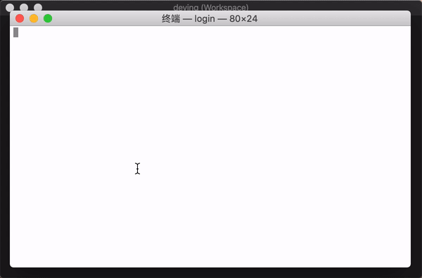

# o-tmux

> open vsc .code-workspace file&#39;s folder

[](https://oclif.io)
[](https://npmjs.org/package/o-tmux)
[](https://npmjs.org/package/o-tmux)
[](https://github.com/songlairui/o-tmux/blob/master/package.json)

# Preview

| Command                  | Desktop                          |
| ------------------------ | -------------------------------- |
| [![asciicast][^svg]][^1] |  |

输入 vsc code-workspace 打开预置 panes 的 tmux

# Usage

```bash
o-tmux [workspaceFileName]

o-tmux deving
# 或者
o-tmux deving.code-workspace
```

# Commands

`o-tmux -h` 查看帮助

```bash
$ o-tmux -h

输入 vsc code-workspace 打开 tmux with panes

USAGE
  $ o-tmux [FILE]

OPTIONS
  -f, --force
  -h, --help       show CLI help
  -n, --name=name  workspace file
  -v, --version    show CLI version
```

[^1]: https://asciinema.org/a/283863
[^svg]: https://asciinema.org/a/283863.svg
